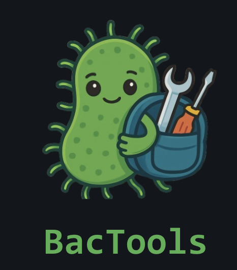

# BacTools

<p align="center">
  
</p>

Automated Software Catalog Creator for Bacterial Data Analysis

## Biological Question and Short Project Description

How can we efficiently identify, curate, and keep current a comprehensive list of existing computational tools for bacterial data analysis?

BacTools automates the creation of a catalog of public software tools for bacterial data analysis by querying multiple online repositories (CRAN, Bioconductor, and GitHub), extracting software metadata, classifying tools by tags and keywords, and exporting the combined, de-duplicated resource list for further use.

The resulting catalog can be used by researchers to identify and compare tools for bacterial genomics, proteomics, and other computational biology investigations.

**Input:**

* CRAN/Bioconductor/GitHub repository search terms (e.g., "bacteria", "microbiome", "genomics")
* Optional query parameters (API tokens, time intervals)

**Output:**

* Combined catalog of bacterial data analysis tools in CSV format
* Tool metadata (name, author, short description, DOI, APA citation, source/platform (CRAN, Bioconductor, GitHub), tutorials, docs, GitHub stars, language, release date, category (metagenomics, evolution, etc.))

This package is an R version of BacToolspy. If you are a Python user, please install that instead to use its functions.

## Installation

You can install the development version of BacTools from GitHub with:

```r
# install.packages("devtools")
devtools::install_github("CreatorClement/BacTools")
```

## Contributing

Is there a feature you'd like to see included? Please let us know! Pull requests are welcome on [GitHub](https://github.com/CreatorClement/BacTools/pulls).

## Acknowledgements

* AI was used to format the files in [Documents](https://github.com/CreatorClement/BacTools/tree/main/documents) and the catalogs within the test folder
* Drawio was used to develop the [DDS document](https://github.com/CreatorClement/BacTools/blob/main/documents/bactools_DDS.pdf)

